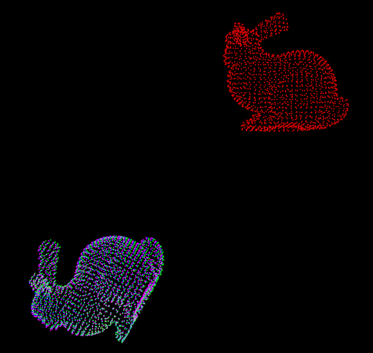
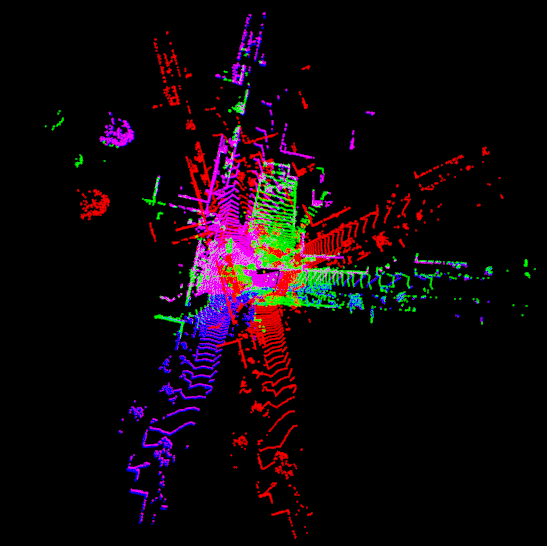

# Quatro using TEASER++ Library

Official page of [*"A Single Correspondence Is Enough: Robust Global Registration to Avoid Degeneracy in Urban Environments"*](https://arxiv.org/abs/2203.06612), which is accepted @ ICRA'22. **NOTE that this repository is the re-implmenation, so it is not exactly same with the original version**.   

We provide some examples to show how to use Quatro implemented in TEASER++ library 

(15, Oct. 2022: it is still not merged. I did PR to TEASER++ repository).


Originally, We provide Quatro using Point Cloud Library ([here](https://github.com/url-kaist/Quatro), but we also integrate Quatro in [TEASER++ library](https://github.com/MIT-SPARK/TEASER-plusplus) for convenience.

## Contents
1. [Test Env.](#Test-Env.)
0. [How to Build](#How-to-Build)
0. [How to Run Quatro](#How-to-Run-Quatro)
0. [Citation](#citation)


## Test Env.

* PCL 1.8
* Linux 18.04 LTS


Note that I copied raw files of TEASER++ due to the PCL version issue (Original: 1.9 / Mine: 1.8 in Ubuntu 18.04), 

The original files can be found in [Here](github.com/MIT-SPARK/TEASER-plusplus/tree/master/teaser/include/teaser)


## How to Build

### Install TEASER++ 

1. Install the original [TEASER++ library](https://github.com/MIT-SPARK/TEASER-plusplus). Follow the **Minimal C++ example** since Quatro is included in `include/teaser/registration.h`


2. Then, run the following script. 

```
git clone git@github.com:LimHyungTae/quatro-cpp-fpfh.git
cd quatro-cpp-fpfh && mkdir build && cd build
cmake ..
make -j 8
```


## How to Run Quatro

### Case A. Bunny dataset

```
OMP_NUM_THREADS=8 ./quatro_cpp_fpfh
```





```bash
=====================================
           Quatro Results            
=====================================
Error (deg): 0.990611
Estimated translation (m): 0.00152444
=====================================
          TEASER++ Results           
=====================================
Error (deg): 2.2537
Estimated translation (m): 0.00269122
```


### Case B. KITTI dataset


In this study, fast point feature histogram (FPFH) is utilized, which is widely used as a conventional descriptor for the registration. However, the original FPFH for a 3D point cloud captured by a 64-channel LiDAR sensor takes **tens of seconds**, which is too slow. For this reason, we employ voxel-sampled FPFH, which is preceded by voxel-sampling. This is followed by the correspondence test. 

```
OMP_NUM_THREADS=8 ./quatro_cpp_fpfh_in_kitti
```




## Citation

If our research has been helpful, please cite the below papers:

```
@article{lim2022quatro,
    title={A Single Correspondence Is Enough: Robust Global Registration to Avoid Degeneracy in Urban Environments},
    author={Lim, Hyungtae and Yeon, Suyong and Ryu, Suyong and Lee, Yonghan and Kim, Youngji and Yun, Jaeseong and Jung, Euigon and Lee, Donghwan and Myung, Hyun},
    booktitle={Proc. IEEE Int. Conf. Robot. Autom.},
    year={2022},
    pages={Accepted. To appear}
    }
```

## Acknowledgment
This work was supported by the Industry Core Technology Development Project, 20005062, Development of Artificial Intelligence Robot Autonomous Navigation Technology for Agile Movement in Crowded Space, funded by the Ministry of Trade, Industry & Energy (MOTIE, Republic of Korea) and by the research project “Development of A.I. based recognition, judgement and control solution for autonomous vehicle corresponding to atypical driving environment,” which is financed from the Ministry of Science and ICT (Republic of Korea) Contract No. 2019-0-00399. The student was supported by the BK21 FOUR from the Ministry of Education (Republic of Korea).

## License
<a rel="license" href="http://creativecommons.org/licenses/by-nc-sa/4.0/"></a><br />This work is licensed under a <a rel="license" href="http://creativecommons.org/licenses/by-nc-sa/4.0/">Creative Commons Attribution-NonCommercial-ShareAlike 4.0 International License</a>.


### Copyright
- All codes on this page are copyrighted by KAIST published under the Creative Commons Attribution-NonCommercial-ShareAlike 4.0 License. You must attribute the work in the manner specified by the author. You may not use the work for commercial purposes, and you may only distribute the resulting work under the same license if you alter, transform, or create the work.
